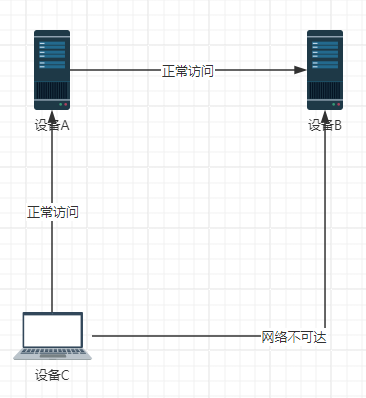

# IP网桥

## 工具简介

写这个小工具的原因是因为[帕鲁](https://store.steampowered.com/app/1623730/Palworld/)开私服不支持ipv6通信，而我又无公网ipv4。想要开私服只能购买腾讯/阿里/百度/..等公有云服务。4202年了，已然能p2p通信，为何还要再掏钱？

### 功能

当出现以下情况时，可以在设备A上运行本软件，可以实现C对B的访问



基于netty实现对数据包转发

适用于在不改动设备及网络配置情况下，在不同网段上架设网桥。

## 环境要求：

1. jdk21

## 使用：

[点击下载jdk](https://download.oracle.com/java/21/latest/jdk-21_windows-x64_bin.zip)

解压入jre文件夹中

```
Cure's Code
|-bin
|	|-网桥工具.exe
|
|-config
|
|-log
|
|-jre
|	|-bin
|	|-include
|	|-jmods
|	|-legal
|	|-lib
...
```

启动`网桥工具.exe`即可


先起服务器，然后启动本软件，将服务域名设为`127.0.0.1`，端口为需要透传的端口，然后其他人在别的机器上将服务端口设置为你的本地端口，ip为他能ping通你设备上的公网IPv6地址，他启动后链接本地的端口即可透传到你的服务器上

功能后续可能会完善，如保存配置文件/支持TCP协议等...
